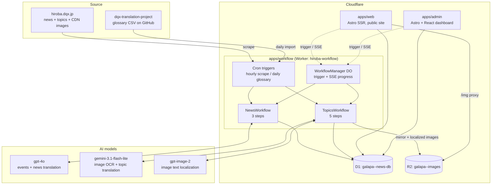
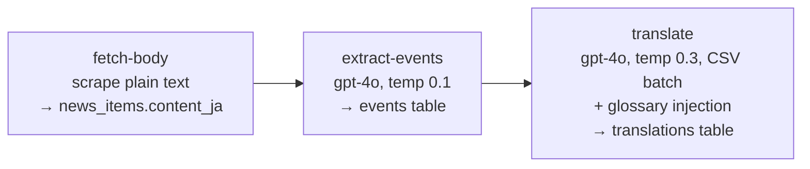
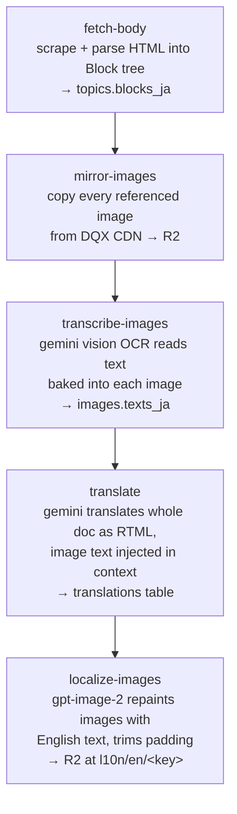
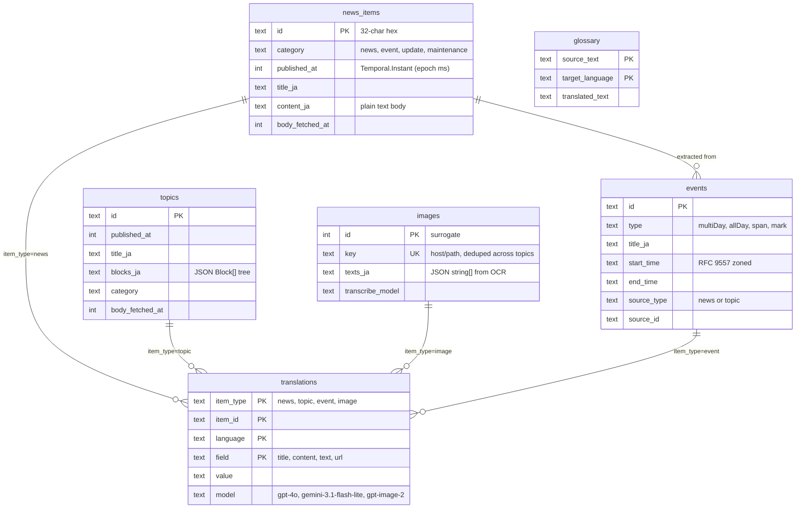
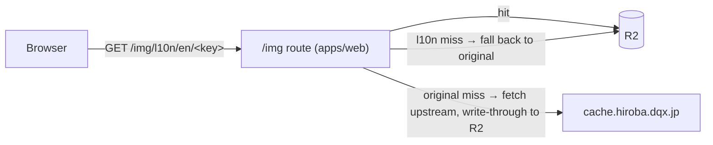

# Hiroba — Galapa News & Topics Translation

A Cloudflare-native monorepo that scrapes news and rich-text "Topics" articles from
[hiroba.dqx.jp](https://hiroba.dqx.jp) (the Dragon Quest X community portal), translates them
from Japanese to English with LLMs — including the text **baked into images** — and serves
them on a fantasy-themed public site.

## System overview



Everything runs on Cloudflare: one Worker with two [Workflows](https://developers.cloudflare.com/workflows/),
a Durable Object coordinator, a shared D1 database, an R2 bucket for images, and two Astro SSR
apps that query D1 directly (no API gateway layer).

## Repository layout

```
hiroba/
├── apps/
│   ├── workflow/     # Cloudflare Worker: cron scraping, translation workflows, DO coordinator
│   ├── web/          # Astro SSR — public site (no React), fantasy/parchment theme
│   └── admin/        # Astro SSR + React — editorial dashboard (behind Cloudflare Access)
├── packages/
│   ├── db/           # Drizzle ORM schema + query helpers for D1
│   ├── richtext/     # Block/Inline document model, RTML (de)serializer, HTML renderer
│   ├── scraper/      # Cheerio scrapers: news lists/bodies, topics lists/bodies, glossary
│   └── shared/       # Categories, JST date parsing, freshness/recheck rules
├── docs/
│   ├── plan.md       # Living design doc for the rich-text topics pipeline
│   └── design-reference/  # Screenshots + inventory of DQX visual components
├── turbo.json        # Turborepo tasks: dev, build, deploy, typecheck, test, lint
└── pnpm-workspace.yaml
```

## The two content types

|                   | **News** (`news_items`)                                  | **Topics** (`topics`)                                |
| ----------------- | -------------------------------------------------------- | ---------------------------------------------------- |
| Source            | 4 category list pages (news, event, update, maintenance) | `/sc/topics/` + monthly backnumber archives          |
| Body format       | Plain text (HTML stripped)                               | Rich-text `Block[]` tree (17 block types)            |
| Translation model | gpt-4o, CSV batch format                                 | gemini-3.1-flash-lite, whole-document RTML           |
| Extras            | Calendar event extraction                                | Image mirroring, OCR, and on-image text localization |
| Workflow          | `NewsWorkflow` (3 steps)                                 | `TopicsWorkflow` (5 steps)                           |

## Translation pipelines

### NewsWorkflow



Events are classified as `multiDay`, `span`, `allDay`, or `mark` and stored with
RFC 9557 zoned timestamps for calendar rendering.

### TopicsWorkflow



The interesting part: image text is **transcribed once per unique image** (deduplicated by
`imageKey`), translated **in the context of the full article** so terminology matches the
surrounding prose, then **baked back into the image** with gpt-image-2. The localized PNG is
trimmed back to the source aspect ratio and stored in R2 under `l10n/en/<key>`.

### RTML: the translation wire format

`packages/richtext` serializes the block tree to **RTML** — a compact HTML-like markup where
tags and attributes carry structure and only element content is translatable. The LLM
translates the RTML document; `parseTranslation()` parses the result back into a typed block
tree. Round-tripping is identity-preserving and covered by tests. This keeps the LLM from
mangling structure while still letting it see full document context.

### Orchestration

- **Cron (hourly)** — scrape the first page of each news category plus incremental topics;
  new items are upserted and their workflow triggered automatically.
- **Cron (daily, midnight JST)** — reimport the community glossary from the
  [dqx-translation-project](https://github.com/dqx-translation-project/dqx-custom-translations) CSV.
- **On demand** — `POST /trigger` on the worker, or per-item buttons in the admin UI. The
  `WorkflowManager` Durable Object dedupes concurrent runs per item and streams progress
  over SSE, which both frontends proxy to the browser (live "translating…" status on
  article pages).
- **Freshness** — recently published articles get their bodies rechecked on an age-scaled
  interval (1h–168h, from `packages/shared/src/freshness.ts`); the admin recheck queue
  surfaces what's due.

## Data model



All translated output lands in the single `translations` table, keyed by
`(item_type, item_id, language, field)` — so a topic's title, its body, each image's text,
and each localized image URL are independent rows with their own model attribution.
Timestamps use custom Drizzle column types wrapping `Temporal` (see
`packages/db/src/types/`).

## Image serving

`apps/web` exposes a self-healing R2-backed proxy at `/img/*`:



`rewriteImageSrc()` in `packages/richtext` points rendered image tags at `/img/<key>` (or
`/img/l10n/en/<key>` when viewing the English translation), hosts are whitelisted to
`*.dqx.jp`, and objects are served with a 1-year immutable cache.

## Apps

### apps/workflow — the pipeline Worker

Entry: `src/index.ts` (fetch handler + cron `scheduled()`). Key modules:

| Module                                    | Role                                                                                 |
| ----------------------------------------- | ------------------------------------------------------------------------------------ |
| `news-workflow.ts` / `topics-workflow.ts` | Workflow classes and step sequencing                                                 |
| `steps/*.ts`                              | One file per pipeline step (fetch, extract, translate, mirror, transcribe, localize) |
| `workflow-manager.ts`                     | Durable Object: per-item run dedupe, status polling, SSE fan-out                     |
| `gemini.ts`                               | Gemini via its OpenAI-compatible endpoint                                            |
| `image-edit.ts` / `image-trim.ts`         | gpt-image-2 wrapper + PNG/JPEG/GIF header parsing and padding trim                   |
| `migrations/`                             | The D1 migrations (10 so far) — applied via root `pnpm db:migrate:*` scripts         |

### apps/web — public site

Astro 5 SSR on Cloudflare, no React. Queries D1 directly via `@hiroba/db`. Topic bodies render
through `renderBlocks()` from `@hiroba/richtext` (unstyled `rt-*` class names, styled per-page).
Fantasy/parchment design system lives in `src/styles/palette.css` + `global.css` with
light/dark themes. Article pages open an SSE connection for live translation progress when a
body isn't ready yet.

### apps/admin — editorial dashboard

Astro 5 SSR + React 19. No in-app auth — deployed behind Cloudflare Access. Provides: stats
dashboard, scrape triggers (incremental, plus full archive backfill across ~168 monthly topic
sources), per-item workflow runs with live SSE status, body invalidation, translation deletion,
event management, glossary browse/lookup/import (CSV upload or GitHub sync), and the
freshness recheck queue.

## Packages

| Package            | What it is                                                                                                                                                                                                                                                                            |
| ------------------ | ------------------------------------------------------------------------------------------------------------------------------------------------------------------------------------------------------------------------------------------------------------------------------------- |
| `@hiroba/db`       | Drizzle schema (6 tables), `createDb(d1)`, and all query helpers. Custom column types for `Temporal.Instant`, `Temporal.ZonedDateTime`, and validated JSON.                                                                                                                           |
| `@hiroba/richtext` | The typed document model: 7 inline node types, 17 block types (headings, infoboxes, accordions, interviews, rankings, steps, speech bubbles, tables…). RTML serializer/parser for translation, HTML renderer for display, `imageKey`/`collectImageUrls` utilities. No workspace deps. |
| `@hiroba/scraper`  | Cheerio-based scrapers for news lists/bodies and topics lists/bodies (including monthly backnumber archives), plus the glossary CSV fetcher. The topics parser maps ~30 DQX CSS classes to block types via 17 prioritized extractors.                                                 |
| `@hiroba/shared`   | `CATEGORIES` + JP→EN category mapping, JST date parsing, and the age-based freshness/recheck interval rules.                                                                                                                                                                          |

Dependency direction: `richtext` and `shared` are leaves; `db` depends on both;
`scraper` depends on all three; apps depend on everything.

## Development

```bash
pnpm install
cp .env.example .env          # add OPENAI_API_KEY (GEMINI_API_KEY needed for topics pipeline)
pnpm db:setup                 # create local D1 + apply migrations
pnpm dev                      # turbo dev — all apps
```

Local dev shares one Miniflare state directory (`.wrangler-shared/`) so the worker and both
Astro apps see the same local D1/R2. Ports: workflow **8787**, web **4321**, admin **4322**.

```bash
pnpm test                     # vitest (richtext, scraper, shared, workflow)
pnpm typecheck
pnpm lint
pnpm db:migrate:local         # apply migrations to local D1
pnpm db:migrate:prod          # apply migrations to production D1
pnpm deploy                   # turbo deploy — wrangler deploy per app
```

## Production topology

- Worker `hiroba-workflow` — workflows, Durable Object (`WORKFLOW_MANAGER`), crons
- D1 `galapa--news-db` — bound as `DB` in all three apps
- R2 `galapa--images` — bound as `IMAGES_BUCKET` in workflow and admin; the web app serves images from the bucket's public custom domain (`IMAGE_BASE`)
- Secrets: `OPENAI_API_KEY`, `GEMINI_API_KEY`, `SENTRY_DSN` (workflow only)
- Admin protected by Cloudflare Access at the edge (no app-level auth)
